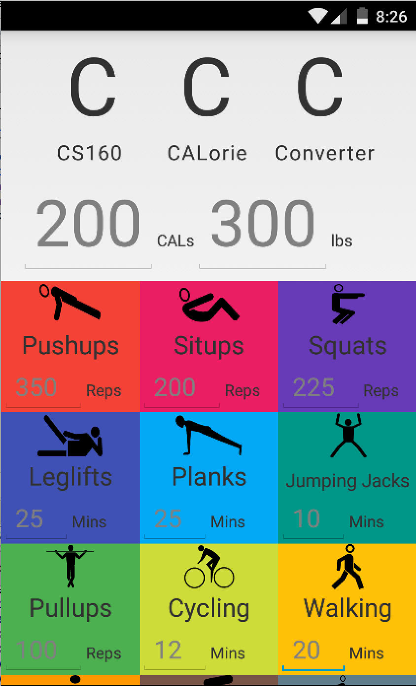

# PROG 01: Crunch Time

This is the the CAL CCC: the CS160 CALorie Converter! When the user starts up the app, the default settings are 0 calories and 150 pounds. The user can then click on the line with the number of calories that should be burned, input a number, and once the user presses “Enter” on the keyboard or clicks away, the app will reveal the amount of each exercise that must be done to burn that amount of calories. Then, the user will be able to click on one of the individual exercises, and similarly input a number and click “Enter” to complete typing, and the app will automatically react to reflect the number of calories burned from doing such an exercise and the amount of other exercises that must be done to burn the same number of calories. The user can then change the weight in a similar manner and see the amount of an exercise that must be done change to reflect the new weight. The user can then continue to change the amount of an exercise done or the number of calories to be burned, and the app will reflect the new weight inputted by the user in all of its calculations. Ultimately, the goal is to provide an experience in which there are no buttons and in which all the user has to do is start typing, and the app will automatically reflect whatever the user wants when he/she is done typing! The app is intended to work with the user as he/she plays with it. The colors and typography are intended to enhance the design and clarify the exercises, respectively. It is hoped that this CALorie converter will help CAL students with their fitness interactively as they finish typing.

## Authors

Sandeep Subramanian ([sandsub95@berkeley.edu](mailto:sandsub95@berkeley.edu))

## Demo Video

See [CCC: CS160 CALorie Converter] (https://github.com/cs160-sp16/prog-01-crunch-time-sandsub95/video/prog01.m4v)

## Screenshots

## Acknowledgments

* Material Palette for colors
* The Noun Project for icons: (see prog-01/app/src/main/res/drawable/*.xml for icon sources & editing tools)
* Stack Overflow for lots of tips

*Feel free to enhance your README. For Markdown syntax, see [the GitHub Guides](https://guides.github.com/features/mastering-markdown/).* (Keeping this here so that I can reference it later.)
